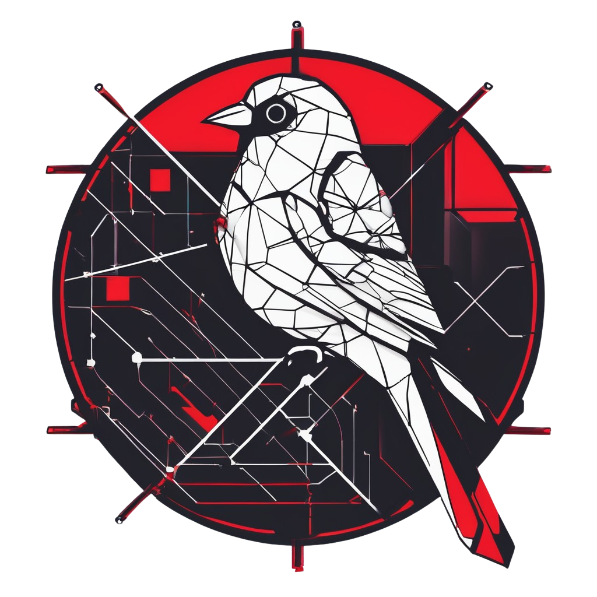

# VulnNetGen



VulnNetGen is a tool to generate a network of vulnerable Linux and Windows AD machines. Customize every virtual machine and every vulnerability with GUI.

## Installation

In project root folder, run the following command to install the dependencies
```bash
sudo setup.sh
```

## Usage

```
$ ./VulnNetGen

Usage: main.py [OPTIONS] COMMAND [ARGS]...

Options:
  --help  Show this message and exit.

Commands:
  gui   Start the Flask server
  list  List out all the available scenerios
  run   Running the specified scenerios
```

Visit the GUI at [http://127.0.0.1:5000](http://127.0.0.1:5000):
```bash
./VulnNetGen gui
```

Check what scenarios are available:
```
./VulnNetGen list
```
```
+--------------------------+
| Scenerios                |
+--------------------------+
| linux_default_ftp        |
| linux_careless_developer |
| windows_machine          |
| linux_wordpress          |
+--------------------------+
```

Run a Scenario:
```
./VulnNetGen run -s linux_default_ftp
```

## Things to note

1. **DO NOT** deploy any of the virtual machines from this project to any real-word system. The virtual machines are intentionally vulnerable and can be easily exploited by attackers.
2. Building a scenario with multiple machines, especially Windows / AD machines, requires significant memory resources. For example, a Windows virtual machine typically takes 4 GB memory. Please make sure you have enough memory resources before running the scenarios.
3. Building a AD Scenario takes very long time. 

## How it works

- Vagrant is used to create and manage virtual machines
- Ansible is used to install vulnerabilities and other necessary system components (e.g. AD service) to the VMs.
- Flask is used to host the web GUI
- Scenario File is the key to generate any Scenario. It contains all information of the machines, the vulnerabilities, and the network configuration. Use our GUI to help you generate it.

## Contributing

We welcome contributions! Please follow the guidelines in [CONTRIBUTING](CONTRIBUTING.md) when submitting pull requests or reporting issues.

## Authors and Acknowledgements
- Stanley Chan ([@stanley0010](https://github.com/stanley0010)) and Charles Cheng ([@a1668k](https://github.com/a1668k))
- Special thanks to [GOAD](https://github.com/orange-cyberdefense/goad/) and [SecGen](https://github.com/cliffe/SecGen) for the inspiration and their work. We directly used codes from GOAD for building AD Scenarios. And thanks to Prof. Ricci IEONG for the guidance all along.
